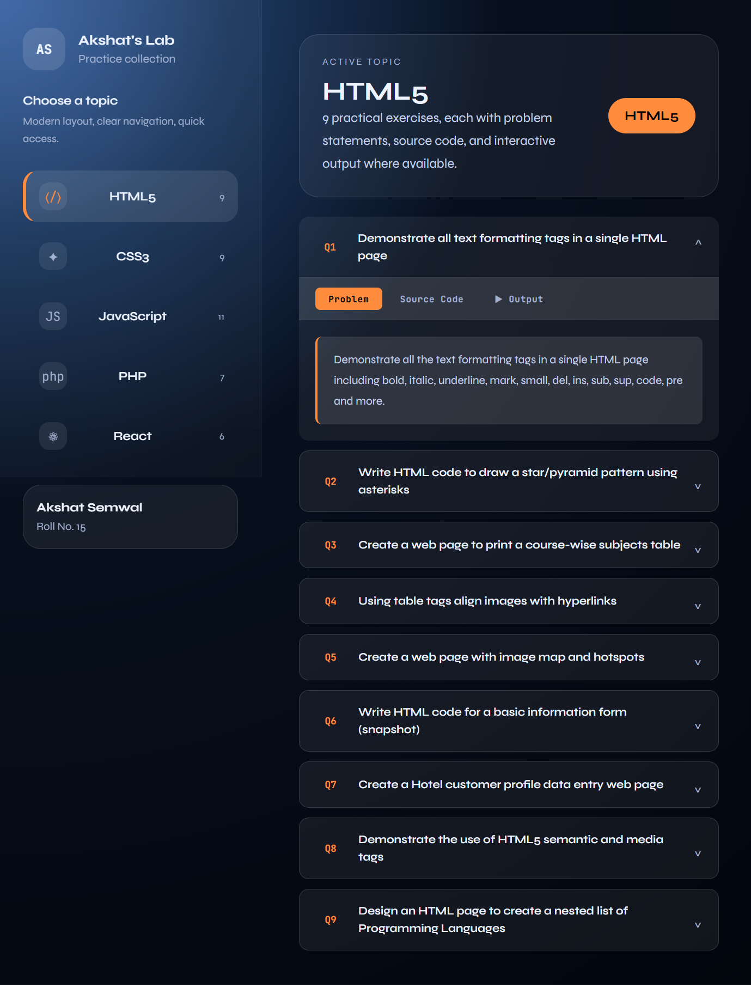
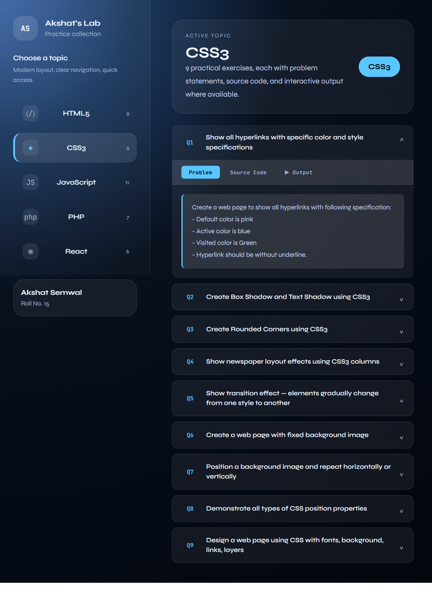

# LAB MANUAL FSWD

Hey there! This is my Full Stack Web Development lab manual project. It's a handy tool for browsing through practical exercises across different web technologies like HTML, CSS, JavaScript, PHP, and React. Each topic has interactive cards with problem statements, source code, and even live outputs where possible.

## Screenshots

Here's what the app looks like in action:

### Main Overview

### Expanding a Question

### Switching to CSS Topics

## Getting Started

To run this locally, just clone the repo, install dependencies with `npm install`, and start it up with `npm start`. It should be live at `http://localhost:3000` in your browser.

Feel free to explore and use it for your web dev learning!
